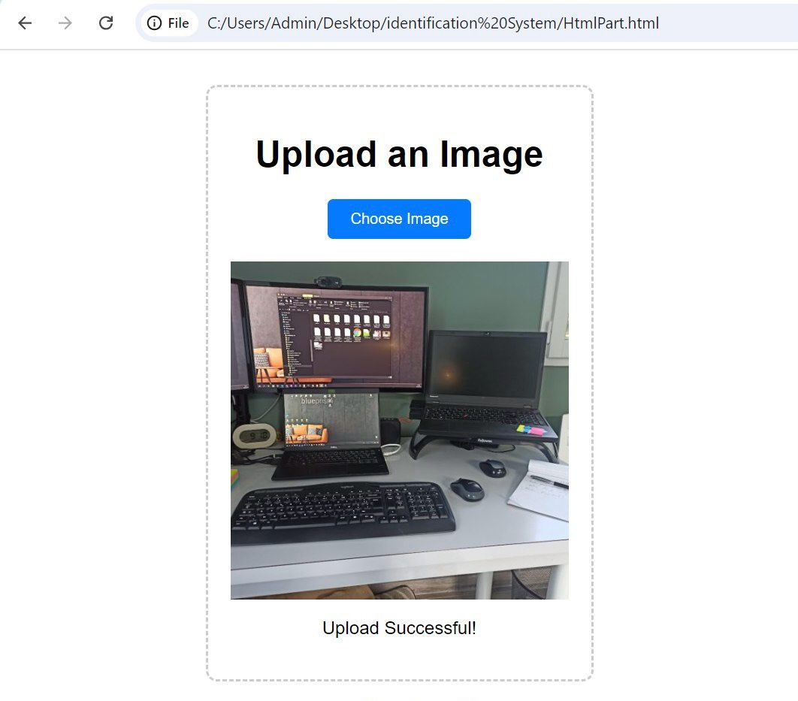
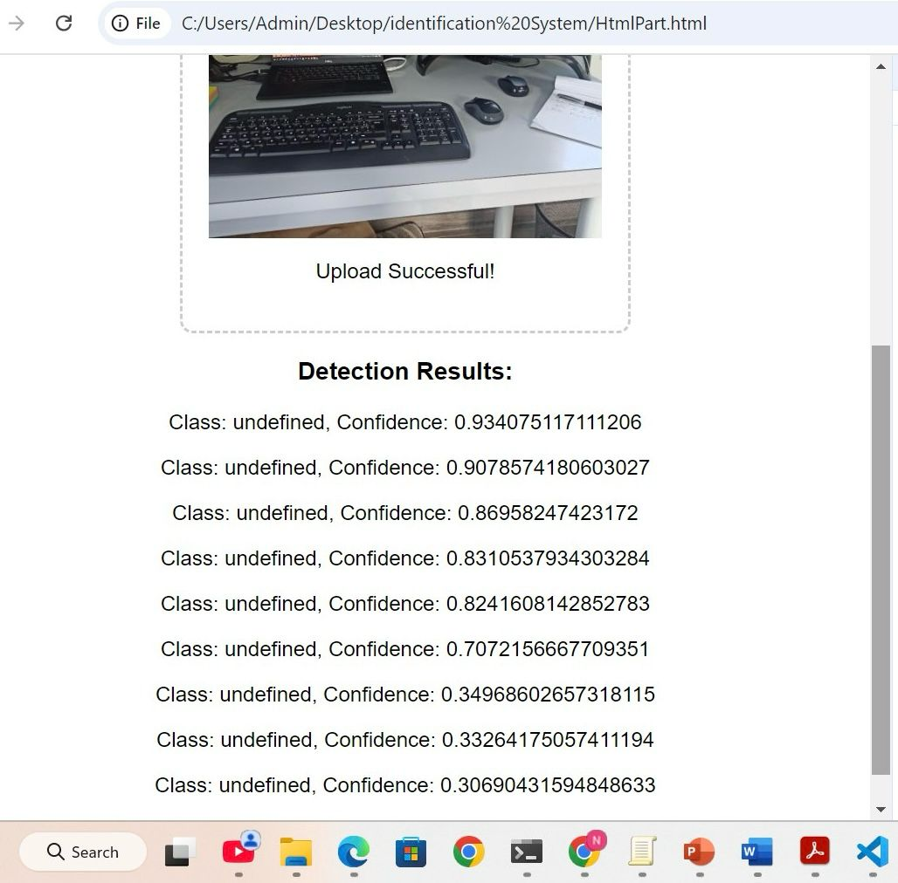
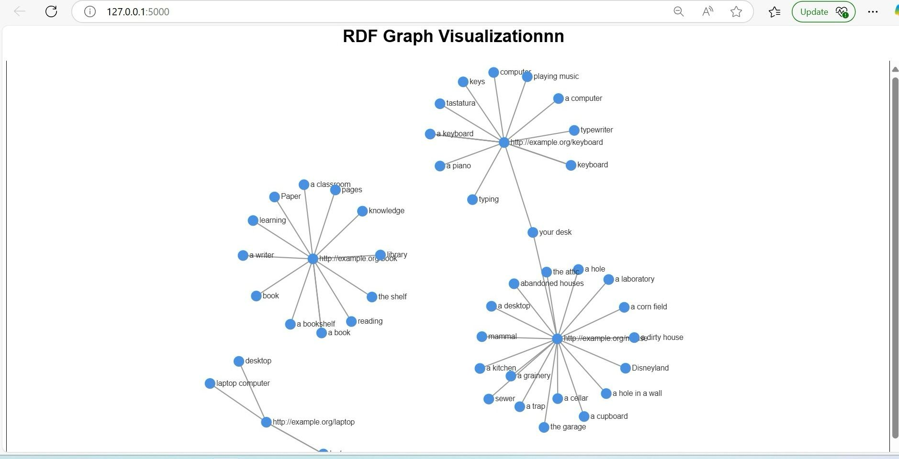
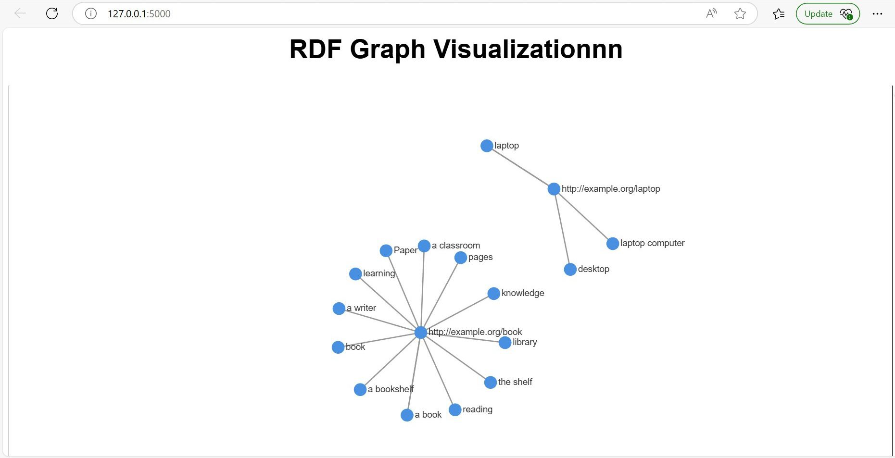
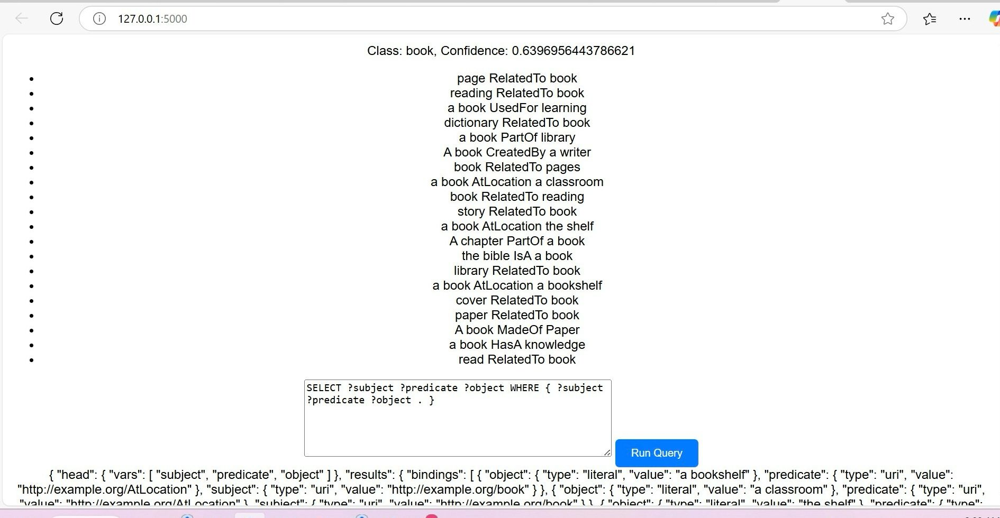
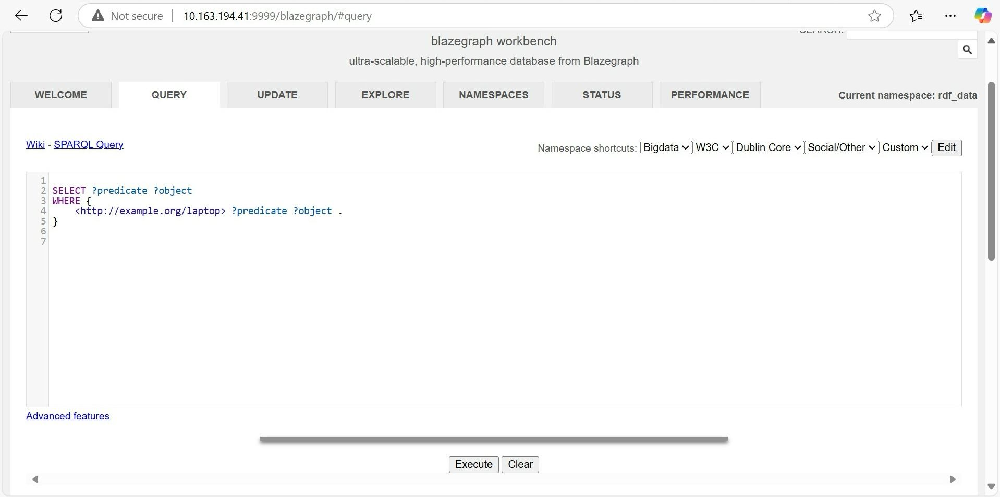
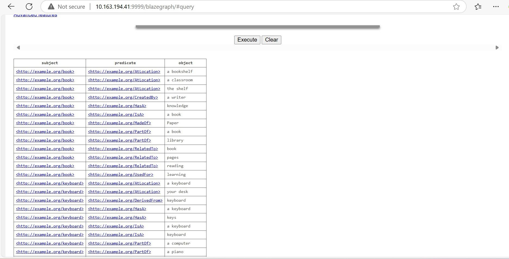

# Semantic image recognition and storage in an OWL RDF knowledge graph 
## Overview
This project integrates object detection and semantic linking to recognize objects in images and represent them in an RDF knowledge graph. Using **YOLOv8** and **ConceptNet**, it generates RDF triples stored in **Blazegraph**, enabling SPARQL querying and semantic graph visualization in compliance with OWL/RDF standards.

## Features
- **Object detection** using YOLOv8.
- **Concept linking** with ConceptNet API.
- **RDF generation** and storage in Blazegraph.
- **SPARQL querying** for structured data retrieval.
- **Graph visualization** of RDF relationships.
- **RDF files** are automatically stored in the output/ folder.

## Installation

### 1: Clone the Repository
```sh
git clone https://github.com/Siloya/SemanticImageClassification-YOLO-RDF-ConceptNet-SPARQL.git
cd SemanticImageClassification-YOLO-RDF-ConceptNet-SPARQL
```
### 2: install Dependencies
```sh
pip install -r requirements.txt
```
### 3: Start the Blazegraph SPARQL Database
Ensure Blazegraph is running on localhost:9999. If you don’t have Blazegraph installed:
```sh
java -server -Xmx4g -jar blazegraph.jar
```
Then, access Blazegraph at:
```sh
 http://localhost:9999/blazegraph
```
### 4: Start the Backend (Flask API)
```sh
python app.py
```
The backend should start on:
```sh
http://127.0.0.1:5000
```
## Usage

### 1. Upload an Image
- Open [http://127.0.0.1:5000](http://127.0.0.1:5000) in your browser.
- Click **"Choose Image"** and upload an image.
- The system detects objects, links them to **ConceptNet**, and stores **RDF data** in **Blazegraph**.
- The generated RDF files are saved in the output/ directory.

### 2. Query RDF Data
- Use the **SPARQL Query** section in the web interface.
- Run SPARQL queries to explore **RDF relationships**.

### 3. Visualize RDF Graph
- After processing an image, the **RDF graph visualization** will be displayed automatically.
- Explore the relationships between detected objects and concepts .
## Technologies Used
- **Python** – Backend development.
- **Flask** – Web API and interface.
- **YOLOv8 (Ultralytics)** – Real-time object detection.
- **ConceptNet API** – External semantic knowledge source.
- **Blazegraph** – External semantic knowledge source.
- **SPARQL** – Query language for RDF data
- **D3.js** –   Interactive graph visualization.
- **HTML/CSS/JavaScript** – Web interface and visualization logic.
## Overview 
   
  







